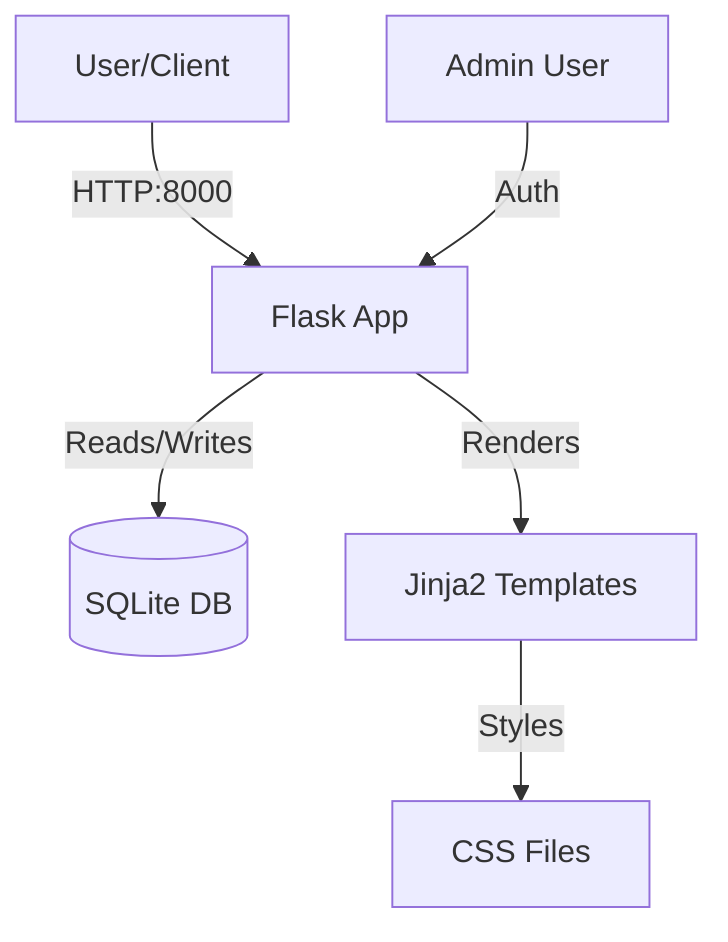

# QuickPoll

A simple, modern polling application built with Python Flask and SQLite.

## Project Description
QuickPoll is a web-based survey tool that allows users to create polls, vote on them, and view real-time results. It features a clean, purple-themed UI, cookie-based duplicate vote prevention, and an admin interface for creating new polls.

## Architecture



## File Structure

```
.
├── app.py              # Main Flask application entry point
├── requirements.txt    # Python dependencies
├── Dockerfile          # Docker configuration
├── data/               # Database directory
│   └── polls.db       # SQLite database (auto-generated)
├── static/
│   └── style.css      # CSS styles
└── templates/          # HTML Templates
    ├── base.html      # Base layout
    ├── index.html     # Home page
    ├── vote.html      # Voting page
    ├── results.html   # Results page
    ├── create.html    # Create poll page
    └── login.html     # Admin login page
```

## Setup Instructions

### Local Development

1.  **Install Dependencies:**
    ```bash
    pip install -r requirements.txt
    ```

2.  **Run the Application:**
    ```bash
    python app.py
    ```
    The application will start on `http://0.0.0.0:8000`.

### Docker Deployment

1.  **Build the Image:**
    ```bash
    docker build -t quickpoll .
    ```

2.  **Run the Container:**
    ```bash
    docker run -p 8000:8000 quickpoll
    ```
    The application will be accessible at `http://localhost:8000`.

## Login Credentials

To create polls, you must log in as an admin.

*   **Username:** `admin`
*   **Password:** `admin123`

## API Endpoints

| Method | Endpoint | Description |
| :--- | :--- | :--- |
| `GET` | `/` | Home page, lists active polls |
| `GET` | `/vote/<id>` | View voting page for a poll |
| `POST` | `/vote/<id>` | Submit a vote |
| `GET` | `/results/<id>` | View results for a poll |
| `GET` | `/create` | Create poll page (Protected) |
| `POST` | `/create` | Submit new poll (Protected) |
| `GET` | `/login` | Admin login page |
| `POST` | `/login` | Submit login credentials |
| `GET` | `/health` | Health check (returns `{"status": "ok"}`) |

## Generation Prompt

The following prompt was used to generate this application:

> Build a Python Flask application for a Quick Poll/Survey tool. Use SQLite for the database and Jinja2 templates for the frontend.
>
> Pages:
> - Home — list of active polls with title and total votes.
> - Vote — select an option and submit vote. Show results as HTML/CSS percentage bars after voting.
> - Create Poll — admin form to create a poll with question and 2-5 options. Protected by simple hardcoded admin login.
> - Results — detailed results page for each poll with vote counts and percentages.
>
> Requirements:
> - Seed the database with 3 polls with 3-4 options each and some votes on first run
> - Fun, modern styling (white, purple, rounded corners)
> - Cookie-based duplicate vote prevention (simple, not bulletproof)
> - Include a /health endpoint that returns {"status": "ok"}
> - SQLite database at ./data/polls.db
> - Include requirements.txt and a Dockerfile
> - Main entry point: python app.py (run on 0.0.0.0:8000)
> - Use Flask, not FastAPI
>
> Documentation:
> - Include a README.md containing: the full prompt used to generate this app, a Mermaid architecture diagram (use simple node labels without slashes or special characters), project file structure, setup instructions for local and Docker, login credentials for each role, and a list of all endpoints.
>
> ---
> ## DEPLOYMENT REQUIREMENTS (MANDATORY)
> ... (See full prompt in conversation history)
